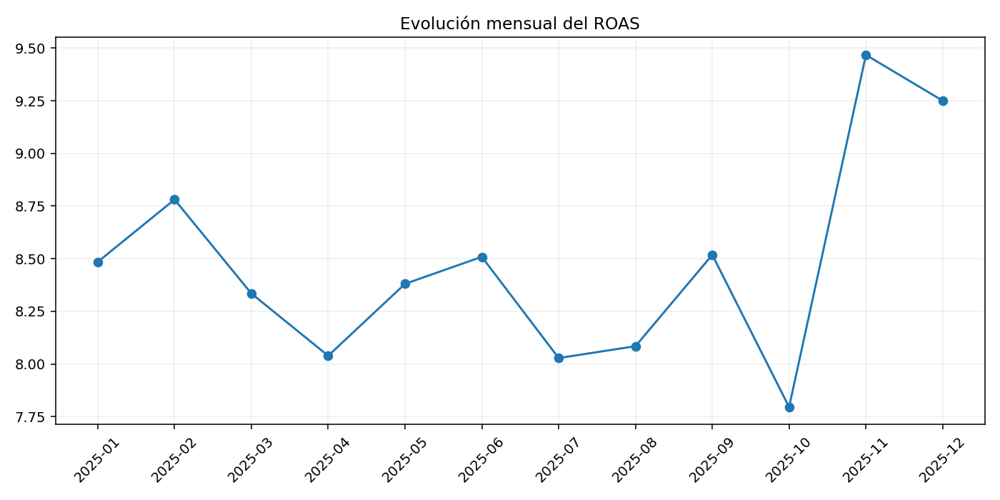
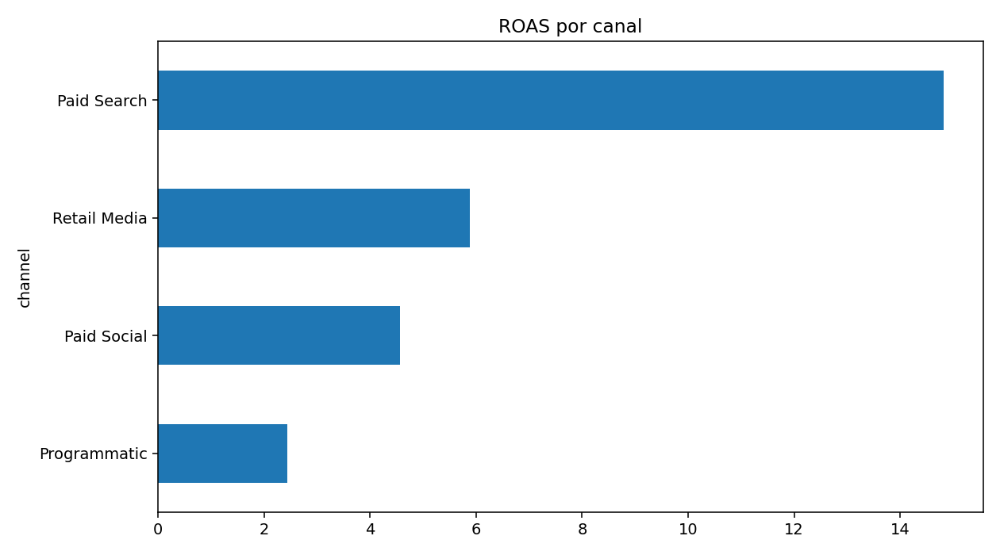
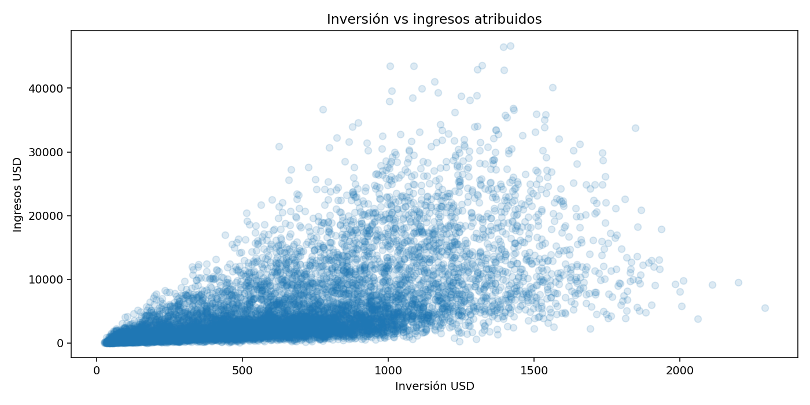
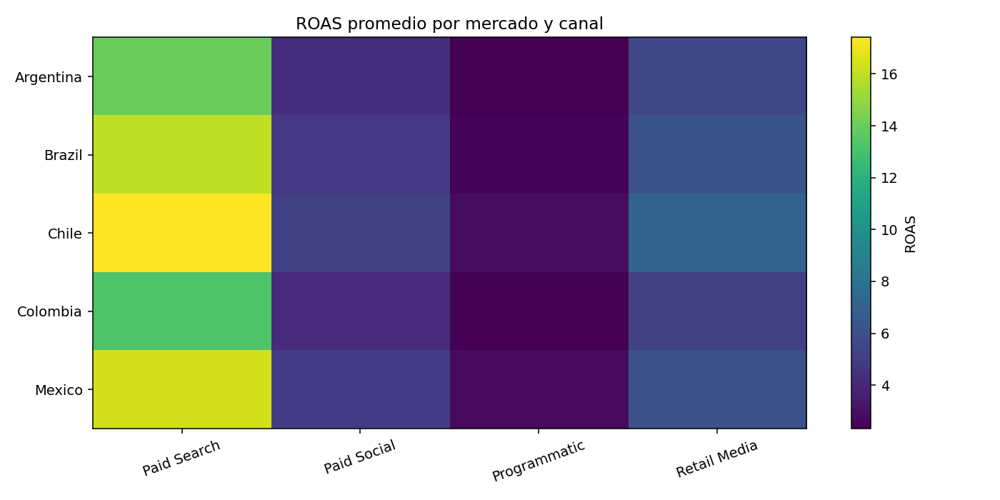

# Media Pulse — Performance Analytics

**Caso de Data Analytics sobre inversión publicitaria, performance y crecimiento.**

Python · SQL · Power BI · Marketing Analytics · Business Intelligence

---

## La idea

**Media Pulse** es un caso de estudio ficticio inspirado en problemas de una agencia de medios moderna: administrar inversión, comparar canales, entender mercados y convertir datos de campañas en decisiones.

> **¿Cómo sabemos si estamos poniendo el dinero correcto, en el canal correcto, para conseguir el resultado correcto?**

El proyecto analiza eficiencia, escala, contexto y oportunidades de optimización.

>  Todos los datos son sintéticos y fueron generados exclusivamente para portfolio.

## Problema de negocio

- ¿Qué canales generan mejor retorno?
- ¿Dónde estamos invirtiendo mucho sin obtener suficiente valor?
- ¿Qué mercados presentan comportamientos diferentes?
- ¿Cómo cambia el rendimiento a lo largo del tiempo?
- ¿Qué campañas parecen eficientes pero tienen poco volumen?
- ¿Dónde existe espacio para investigar una posible reasignación de presupuesto?

## Dataset

**9.000 registros sintéticos de performance durante 2025.**

| Campo | Descripción |
|---|---|
| `campaign_id` | Identificador |
| `date` | Fecha |
| `channel` | Paid Search, Paid Social, Programmatic o Retail Media |
| `market` | Mercado |
| `objective` | Conversion, Consideration o Awareness |
| `device` | Dispositivo |
| `campaign_type` | Brand, Non-Brand, Retargeting o Prospecting |
| `impressions` | Impresiones |
| `clicks` | Clicks |
| `spend_usd` | Inversión |
| `conversions` | Conversiones |
| `revenue_usd` | Ingresos atribuidos |
| `ctr` | Click-through rate |
| `cpc` | Cost per click |
| `cvr` | Conversion rate |
| `roas` | Return on ad spend |
| `cpa` | Cost per acquisition |

## Preguntas analíticas

### 01 — Eficiencia
¿Qué canales y mercados presentan mejores niveles de ROAS y CPA?

### 02 — Escala
¿Los segmentos con mejor eficiencia también tienen suficiente volumen para crecer?

### 03 — Mix de medios
¿Cómo cambia el rendimiento al combinar canal, mercado, dispositivo y tipo de campaña?

### 04 — Evolución
¿El performance cambia por tendencia o por estacionalidad?

### 05 — Presupuesto
¿Qué segmentos deberían investigarse antes de mover inversión?

## Visualizaciones

## Eficiencia ≠ escala

Un ROAS alto no implica automáticamente que convenga asignar más presupuesto. Un segmento puede ser eficiente con poco volumen y no mantener esa eficiencia al escalar.

Por eso el análisis separa: **Eficiencia → Volumen → Contexto → Oportunidad de prueba**.

## KPI principales

ROAS · CPA · CTR · CVR · CPC · Revenue · Spend · Conversions

## Python

Limpieza, KPI, análisis temporal, segmentación, comparación de canales y mercados, outliers y eficiencia vs volumen.

Notebook: `notebooks/01_media_pulse_analysis.ipynb`

## SQL

`sql/analysis.sql` incluye ROAS, CPA, evolución mensual, ranking, objetivos, dispositivos y distribución de presupuesto.

## Dashboard

**Executive Performance:** Spend, Revenue, ROAS, CPA, Conversions y tendencia.

**Channel Performance:** canales, inversión, ROAS, CPA y volumen vs eficiencia.

**Market & Audience:** mercado, dispositivo, objetivo y tipo de campaña.

**Budget Opportunities:** segmentos de interés, outliers y oportunidades para tests.

## Attribution ≠ causalidad

Una conversión atribuida a una campaña no significa que la campaña haya causado por sí sola toda la conversión. El enfoque es: **performance reportada → hipótesis → validación**.

## Tecnologías

Python · Pandas · NumPy · Matplotlib · SQL · Power BI · Git/GitHub

## Descripción para CV

**Media Pulse — Media Performance Analytics | Python, SQL, Power BI**

Desarrollé un caso de Marketing Analytics utilizando 9.000 registros sintéticos para analizar inversión publicitaria, conversiones, ROAS, CPA y performance por canal y mercado. Integré Python, SQL y visualización para identificar patrones de eficiencia, oportunidades de optimización y preguntas de negocio relacionadas con la asignación de presupuesto.

---

## Reflexión final

Los dashboards pueden decirnos **qué pasó**. El trabajo de Analytics empieza cuando preguntamos: **¿por qué pasó, qué deberíamos investigar y cómo podríamos medir si una decisión realmente funcionó?**

📣 <strong>Media Pulse</strong> Marketing Analytics · Performance · Business Intelligence

