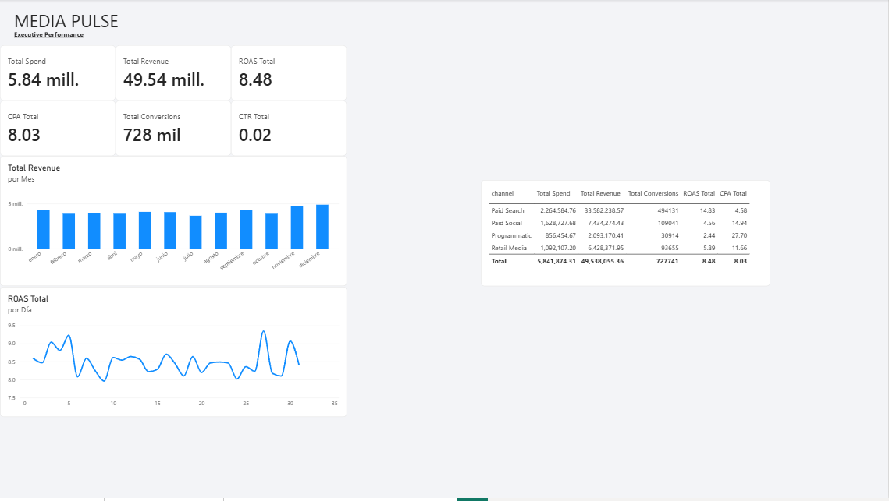
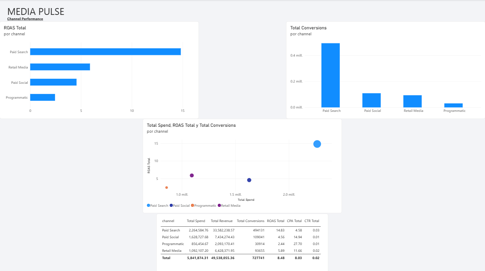
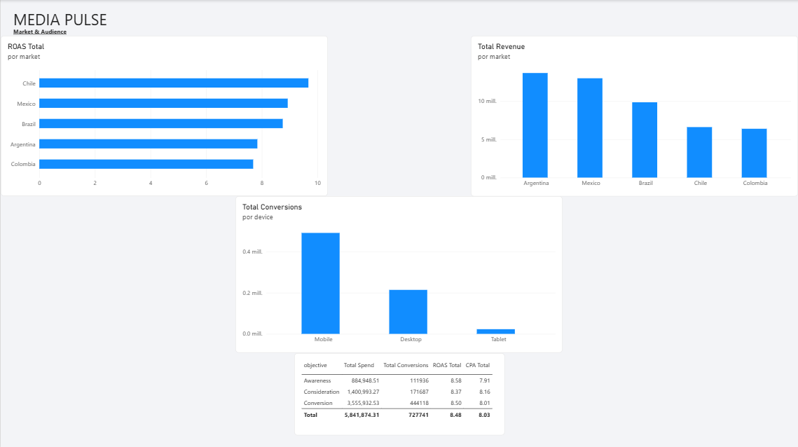
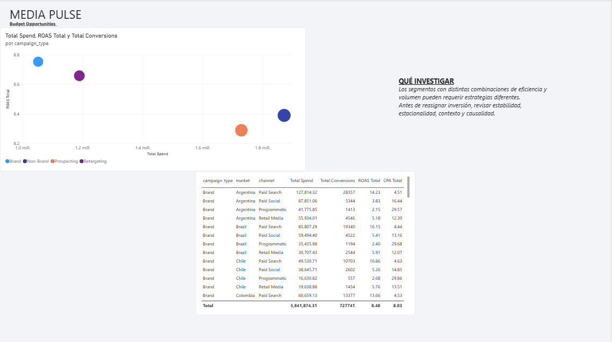

# Media Pulse — Performance Analytics

<p align="center">
  <strong>Un caso de Data Analytics sobre inversión publicitaria, performance y crecimiento.</strong><br>
  Python · SQL · Power BI · Marketing Analytics · Business Intelligence
</p>

<p align="center">
  
  
  
  
</p>

---

## La idea

**Media Pulse** es un caso de estudio ficticio inspirado en problemas reales de **Marketing Analytics y Media Performance**.

El proyecto busca responder una pregunta sencilla:

> **¿Cómo sabemos si estamos poniendo el dinero correcto, en el canal correcto, para conseguir el resultado correcto?**

En lugar de limitarse a mostrar métricas de campañas, el análisis intenta conectar:

**Inversión → Performance → Eficiencia → Contexto → Insight → Decisión**

El objetivo es demostrar cómo los datos pueden utilizarse para investigar oportunidades de negocio y no solamente para construir reportes.

>  **Datos sintéticos:** todo el dataset fue generado exclusivamente para este proyecto de portfolio. No contiene información de clientes, campañas ni cuentas reales.

---

## Problema de negocio

Un equipo de Media Performance administra campañas en diferentes canales y mercados.

El desafío es entender:

- ¿Qué canales generan mayor retorno?
- ¿Dónde se concentra la inversión?
- ¿Qué mercados presentan comportamientos diferentes?
- ¿Cómo cambia el rendimiento a lo largo del tiempo?
- ¿Qué segmentos muestran buena eficiencia pero poco volumen?
- ¿Dónde existen oportunidades que deberían investigarse antes de reasignar presupuesto?

La intención es pasar de:

> **“Este canal tiene un ROAS alto.”**

a:

> **“¿Por qué tiene ese rendimiento, qué volumen maneja y qué deberíamos validar antes de tomar una decisión?”**

---

# Dashboard en Power BI

El Dashboard está dividido en cuatro perspectivas complementarias.

## 01 — Executive Performance

Vista general de la inversión y el rendimiento.

Incluye:

- Total Spend
- Total Revenue
- ROAS
- CPA
- Conversions
- CTR
- evolución mensual
- performance por canal



---

## 02 — Channel Performance

Análisis comparativo entre:

- Paid Search
- Paid Social
- Programmatic
- Retail Media

Incluye:

- ROAS por canal
- Spend vs ROAS
- conversiones
- CPA
- CTR
- CVR
- eficiencia vs volumen



---

## 03 — Market & Audience

Análisis del contexto en el que se producen los resultados.

Incluye:

- performance por mercado
- comparación mercado × canal
- conversiones por dispositivo
- performance por objetivo
- diferencias de comportamiento entre segmentos



---

## 04 — Budget Opportunities

Vista orientada a investigación y toma de decisiones.

Analiza:

- eficiencia vs escala
- segmentos de alto y bajo volumen
- concentración de inversión
- diferencias de performance
- posibles oportunidades de investigación

> **Importante:** esta página no propone reasignar presupuesto automáticamente. Su objetivo es identificar segmentos que merecen un análisis más profundo antes de tomar decisiones.



---

## Archivo Power BI

El archivo original del Dashboard está disponible en:

**[`Media_Pulse_Marketing_Analytics.pbix`](dashboard/Media_Pulse_Marketing_Analytics.pbix)**

---

# Dataset

El proyecto contiene **9.000 registros sintéticos de performance de campañas** correspondientes a 2025.

| Campo | Descripción |
|---|---|
| `campaign_id` | Identificador de campaña |
| `date` | Fecha |
| `channel` | Canal publicitario |
| `market` | Mercado |
| `objective` | Objetivo de campaña |
| `device` | Dispositivo |
| `campaign_type` | Tipo de campaña |
| `impressions` | Impresiones |
| `clicks` | Clicks |
| `spend_usd` | Inversión |
| `conversions` | Conversiones |
| `revenue_usd` | Ingresos atribuidos |
| `ctr` | Click-through rate |
| `cpc` | Cost per click |
| `cvr` | Conversion rate |
| `roas` | Return on ad spend |
| `cpa` | Cost per acquisition |

---

# Preguntas analíticas

### 01 — Eficiencia

¿Qué canales y mercados presentan diferentes niveles de ROAS y CPA?

### 02 — Escala

¿Los segmentos con mejor eficiencia también tienen suficiente volumen?

### 03 — Mix de medios

¿Cómo cambia el rendimiento cuando combinamos canal, mercado, dispositivo y tipo de campaña?

### 04 — Evolución

¿El performance cambia por tendencia, contexto o estacionalidad?

### 05 — Presupuesto

¿Qué segmentos deberían investigarse antes de tomar decisiones sobre inversión?

---

# KPI principales

### ROAS

Mide los ingresos atribuidos por cada unidad monetaria invertida.

### CPA

Representa el costo promedio por conversión.

### CTR

Relaciona clicks con impresiones.

### CVR

Relaciona conversiones con clicks.

### CPC

Mide el costo promedio por click.

### Revenue

Representa los ingresos atribuidos a las campañas.

---

# Eficiencia ≠ escala

Una de las ideas centrales del proyecto es evitar conclusiones demasiado rápidas.

Por ejemplo:

> **“Este canal tiene el ROAS más alto, entonces hay que aumentar su presupuesto.”**

Ese razonamiento puede ser incompleto.

Un segmento puede mostrar una buena eficiencia con poco volumen y no necesariamente mantener ese rendimiento al escalar.

Por eso el proyecto separa:

**Eficiencia → Volumen → Contexto → Validación**

Esta lógica busca acercar el análisis a una situación real de Media Performance, donde una métrica aislada rara vez es suficiente para tomar una decisión.

---

# Análisis con Python

El análisis contempla:

- limpieza y validación
- creación de KPI
- análisis temporal
- segmentación
- comparación entre canales
- análisis por mercado
- detección de outliers
- eficiencia vs volumen
- visualización

Notebook principal:

`notebooks/01_media_pulse_analysis.ipynb`

---

# Análisis con SQL

El archivo:

`sql/analysis.sql`

incluye consultas para:

- ROAS por canal
- CPA por mercado
- evolución mensual
- performance por objetivo
- performance por dispositivo
- comparación entre campañas
- análisis de inversión
- segmentación por contexto

---

# Attribution ≠ causalidad

Una conversión atribuida a una campaña no significa necesariamente que toda la conversión haya sido causada por esa campaña.

Por eso el enfoque utilizado en este proyecto es:

**Performance reportada → Hipótesis → Validación**

Para estudiar causalidad real podrían utilizarse metodologías como:

- experimentos
- holdout groups
- geo-experiments
- incrementality testing
- modelos de atribución

---

# De métrica a decisión

El proyecto utiliza una lógica orientada a investigación:

| Señal | Qué investigar | Posible acción |
|---|---|---|
| ROAS alto + poco volumen | ¿Se puede escalar manteniendo eficiencia? | Diseñar un test |
| ROAS bajo + alto gasto | ¿Qué está deteriorando el retorno? | Revisar estrategia |
| CPA elevado | ¿Dónde está el cuello de botella? | Analizar el funnel |
| Canal fuerte en un mercado y débil en otro | ¿Existe un efecto de contexto? | Segmentar estrategia |
| Mejora mensual | ¿Es estructural o estacional? | Comparar períodos |

---

# Documentación

- `docs/business_case.md` — contexto del negocio y objetivos
- `docs/data_dictionary.md` — descripción de los datos
- `docs/methodology.md` — metodología utilizada
- `dashboard/` — recursos y archivo Power BI
- `sql/analysis.sql` — consultas SQL
- `notebooks/` — análisis con Python

---

# Arquitectura del proyecto

```text
media-pulse-marketing-analytics/
│
├── data/
│   ├── raw/
│   │   └── campaign_performance.csv
│   └── processed/
│       └── monthly_summary.csv
│
├── dashboard/
│   └── Media_Pulse_Marketing_Analytics.pbix
│
├── docs/
│   ├── business_case.md
│   ├── data_dictionary.md
│   └── methodology.md
│
├── images/
│   ├── dashboard_01_executive.png
│   ├── dashboard_02_channel.png
│   ├── dashboard_03_market.png
│   └── dashboard_04_budget.png
│
├── notebooks/
│   └── 01_media_pulse_analysis.ipynb
│
├── sql/
│   └── analysis.sql
│
├── src/
│   └── generate_data.py
│
├── .gitignore
├── LICENSE
├── README.md
└── requirements.txt
